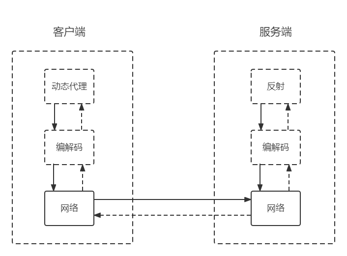

<h3>

RPC框架

</h3>

---

#### 1、什么是RPC

>RPC,全称Remote Procedure Call, 即远程过程调用。
>
>主要作用就是屏蔽网络编程细节，实现调用远程方法就像调用本地方法（同一个进程中的方法）一样的体验。同时屏蔽底层网络通信的复杂性，让我们更加专注业务逻辑的开发。

####  2、原理及模型

>RPC协议广泛的应用于分布式系统中，主要用于不同计算机（即服务节点）间的通信，RPC主要是基于Socket，而Socket又基于TCP，因此我们可以理解为RPC基于TCP协议（部分RPC框架基于HTTP协议），在TCP的基础上增加了编程语言的机制，比如反射、编码与解码、以及动态代理，因此我们可以认为RPC只是一个概念，而实现这一概念有不同方式，典型的RPC框架如gRPC、Thrift、Netty、Dubbo等都是基于这一思想。

