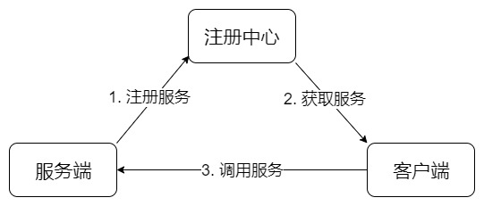

<h3>

RPC框架

</h3>

---

#### 1、什么是RPC

>RPC,全称Remote Procedure Call, 即远程过程调用。
>
>主要作用就是屏蔽网络编程细节，实现调用远程方法就像调用本地方法（同一个进程中的方法）一样的体验。同时屏蔽底层网络通信的复杂性，让我们更加专注业务逻辑的开发。

####  2、原理及模型

>RPC协议广泛的应用于分布式系统中，主要用于不同计算机（即服务节点）间的通信，RPC主要是基于Socket，而Socket又基于TCP，因此我们可以理解为RPC基于TCP协议（部分RPC框架基于HTTP协议），在TCP的基础上增加了编程语言的机制，比如反射、编码与解码、以及动态代理，因此我们可以认为RPC只是一个概念，而实现这一概念有不同方式，典型的RPC框架如gRPC、Thrift、Netty、Dubbo等都是基于这一思想。

#### 3、手写简易RPC框架

一个最简单的 RPC 框架分成三个部分：注册中心、服务端、客户端。以下是一个最简单的结构流程图。

组成：

>1. 注册中心：用于注册和获取服务
>2. 服务端：指提供服务的一方，也叫服务提供方 `Provider`
>3. 客户端：指调用服务的一方，也叫服务消费者 `Consumer`

流程：

>1. 服务端把服务信息注册到注册中心，通常包含服务端地址、接口类和方法
>2. 客户端从注册中心获取对应服务的信息
>3. 客户端根据服务的信息，通过网络调用到服务端的接口

一个基本的 RPC 框架，需要包含以下部分：

>1. 注册中心：注册中心负责服务信息的注册与查找。服务端在启动的时候，扫描所有的服务，然后将自己的服务地址和服务名注册到注册中心。客户端在调用服务之前，通过注册中心查找到服务的地址，就可以通过服务的地址调用到服务啦。常见的注册中心有 `Zookeeper`、`Eureka` 等（这里采用Redis实现）。
>2. 动态代理：客户端调用接口，需要框架能自己根据接口去远程调用服务，这一步是用户无感知的。这样一来，就需要使用到动态代理，用户调用接口，实际上是在调用动态生成的代理类。常见的动态代理有：`JDK Proxy`，`CGLib`，`Javassist` 等。
>3. 网络传输：RPC 远程调用实际上就是网络传输，所以网络传输是 RPC 框架中必不可少的部分。网络框架有 `Java NIO`、`Netty` 框架等。
>4. 自定义协议：网络传输需要制定好协议，一个良好的协议能提高传输的效率。
>5. 序列化：网络传输肯定会涉及到序列化，常见的序列化有`Json`、`Protostuff`、`Kyro` 等。
>6. 负载均衡：当请求调用量大的时候，需要增加服务端的数量，一旦增加，就会涉及到符合选择服务的问题，这就是负载均衡。常见的负载均衡策略有：轮询、随机、加权轮询、加权随机、一致性哈希等等。
>7. 集群容错：当请求服务异常的时候，我们是应该直接报错呢？还是重试？还是请求其他服务？这个就是集群容错策略啦。
